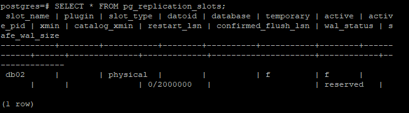

```
db01
  postgres
    vim $PGDATA/pg_hba.conf
      host    replication     standby         192.168.56.101/32       "scram-sha-256"
      host    replication     standby         192.168.56.102/32       "scram-sha-256"

  psql
    select pg_reload_conf();
    9create role standby login replication password 'Pj0zl9pXprWrYbQnQ4x6';
    
  postgres
    vim ~/.pgpass
      192.168.56.102:5432:replication:standby:Pj0zl9pXprWrYbQnQ4x6
    
   chmod 600 ~/.pgpass

db02
  postgres
    cd /pg_data/13/main
      vim ~/.pgpass
        192.168.56.101:5432:replication:standby:Pj0zl9pXprWrYbQnQ4x6
    
   chmod 600 ~/.pgpass
    
   pg_basebackup \
      --pgdata=/pg_data/13/main \
      --write-recovery-conf \
      --checkpoint=fast \
      --create-slot \
      --slot=db02 \
      --wal-method=stream \
      --verbose \
      --progress \
      --dbname="host=192.168.56.101 user=standby sslmode=disable"
    
   rm $PGDATA/log/*.log
   
```
```
  psql
    SELECT * FROM pg_replication_slots;
```
  </img>

